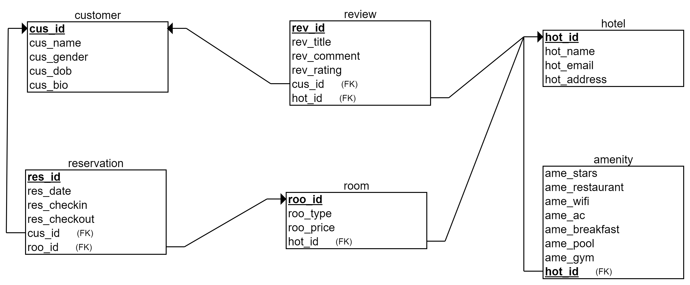

# booking

Booking.com sample project for Plash

Instructions

Download the 'booking' application from Github.

The database relational schema is as below:

The BookingSQL.sql file in the resources folder contains the SQL Scripts for the database.
Run the Scripts in MySQL Workbench.

Import into Eclipse as a Maven Project and do a Maven Install/Update.
Run the BookingApplication.java as a Java Application.

Or else just use Command Prompt and go to the downloaded location and run the below command

 mvn spring-boot:run
 
Since the Tomcat libraries are still there as dependancies we are able to run this application on it’s own.

The following endpoints have been exposed:
Postman Link to the collection: https://www.getpostman.com/collections/2ca78b4d6c944bbf5ded

GET	Fetch All

http://localhost:8080/booking/hotels

http://localhost:8080/booking/customers

http://localhost:8080/booking/reviews

http://localhost:8080/booking/amenities

GET Fetch by Id

http://localhost:8080/booking/hotel/{id}

http://localhost:8080/booking/customer/{id}

http://localhost:8080/booking/review/{id}

http://localhost:8080/booking/amenity/{id}

DELETE Delete by Id

http://localhost:8080/booking/hotel/{id}

http://localhost:8080/booking/customer/{id}

http://localhost:8080/booking/review/{id}

http://localhost:8080/booking/amenity/{id}

POST With proper body as Input

http://localhost:8080/booking/hotel

http://localhost:8080/booking/customer

http://localhost:8080/booking/review

http://localhost:8080/booking/amenity

PUT Update with proper body as Input

http://localhost:8080/booking/hotel

http://localhost:8080/booking/customer

http://localhost:8080/booking/review

http://localhost:8080/booking/amenity

The following features have been successfully implemented:

Service to add/update hotel information in the system. 

Service to add/update user information in the system. 

Service for a user to add reviews for a hotel. A review will include rating and comments. 

Delete information of a hotel, user or delete a review. The data associated with each hotel and user are also deleted accordingly.

All this information will be stored in an RDBMS like MySQL. 

The following technologies have been used:

Java 8

MySQL

SpringBoot

Maven
